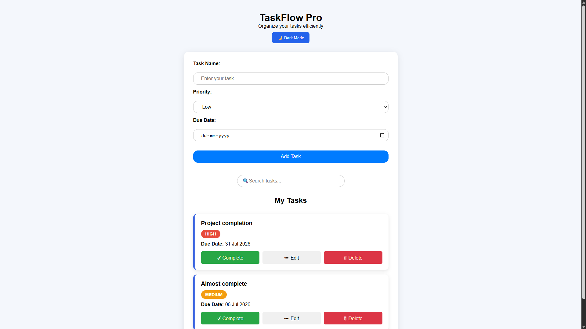
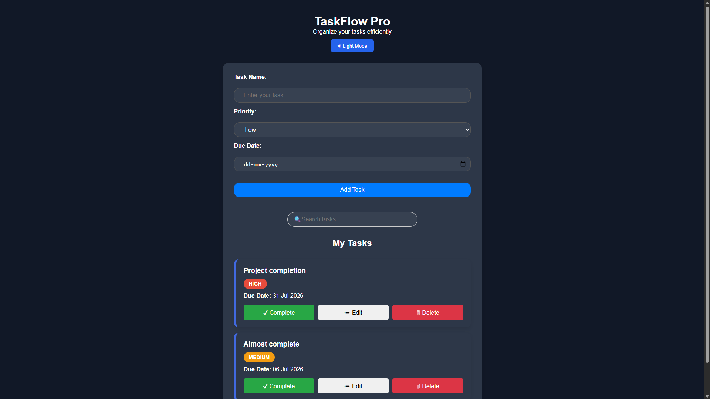
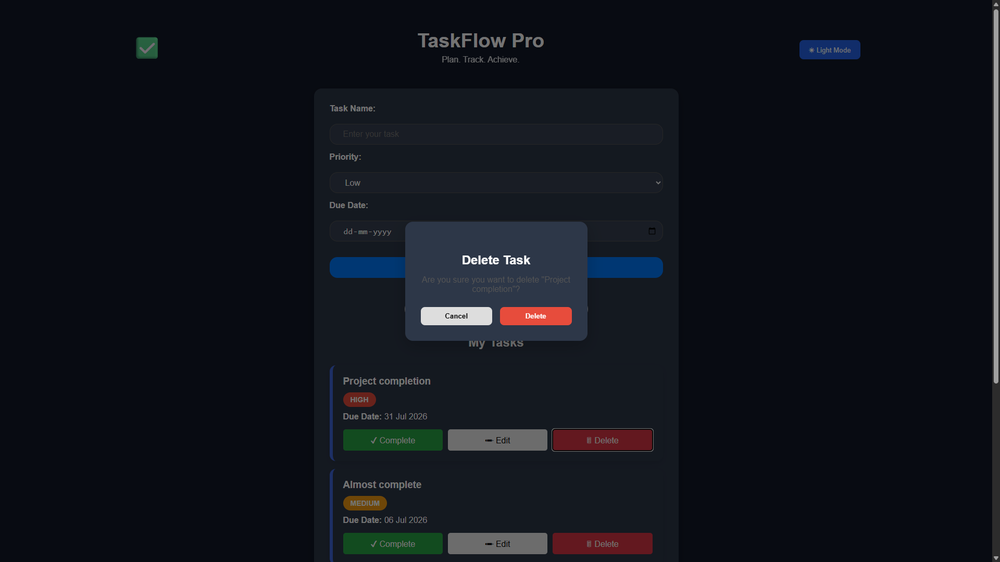

# TaskFlow Pro

A modern task management web application built using HTML, CSS, and JavaScript.

## Features

- ✅ Add new tasks
- ✏️ Edit existing tasks
- 🗑️ Custom delete confirmation modal
- ✔️ Mark tasks as completed
- 🔄 Undo completed tasks
- 🔍 Search tasks instantly
- 📅 Due dates
- 🚦 Priority badges
- 💾 Local Storage support
- 🌙 Dark Mode
- 📱 Responsive Design

## Technologies Used

- HTML5
- CSS3
- JavaScript (ES6)
- Local Storage API

## 📸 Screenshots

### ☀️ Light Mode



### 🌙 Dark Mode



### 🗑️ Delete Confirmation



## 🚀 Installation

1. Clone the repository

```bash
git clone https://github.com/rawatakshay006-ui/taskflow-pro.git
```

2. Open the project folder.

3. Open `index.html` in your browser.

Or simply visit the live demo (GitHub Pages).

## Author

Akshay Singh Rawat
